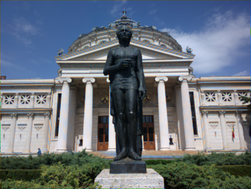
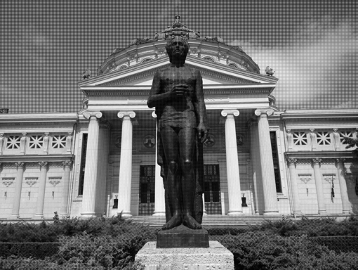

# Color Demosaicing with Linear Regression

This project aims to implement a color demosaicing algorithm based on linear regression. Project is still a WIP, as the linear regression model does not yet yield the desired results.

## Using linear interpolation

A simple linear interpolation is implemented in `linear_interpolation.py`.

## Some samples

Regression:

    

Interpolation:

    

Original greyscale:

    

## TODO

- fix regression model
- finish README
