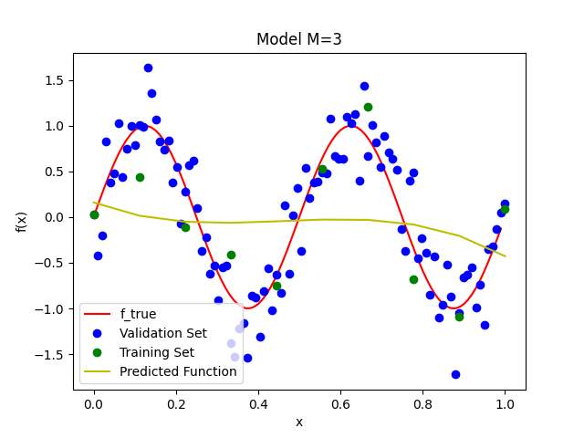
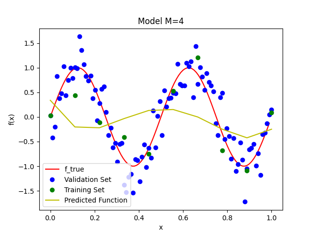
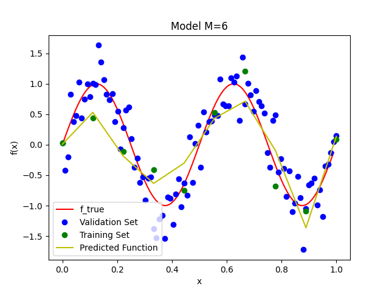
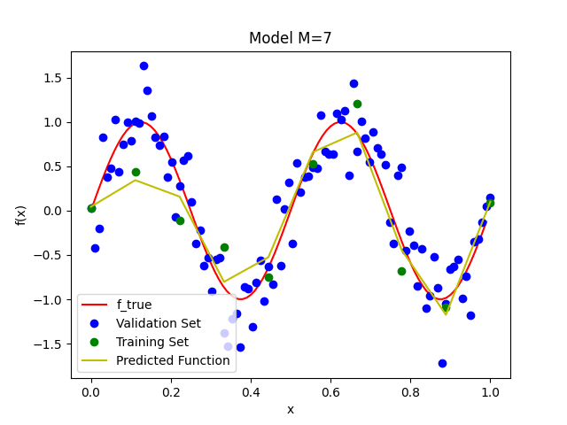

# Lab 1

## Trained Predictors vs f_true graphs

Below is each graph for M=0 to M=9 of the linear regression model. At M=9, you can see that the predicted function passes throguh each point of the training data, shown in green. 

Below is the plot of the training and validation error vs. the dimension of the regression model, before regularization is performed on M=9:

